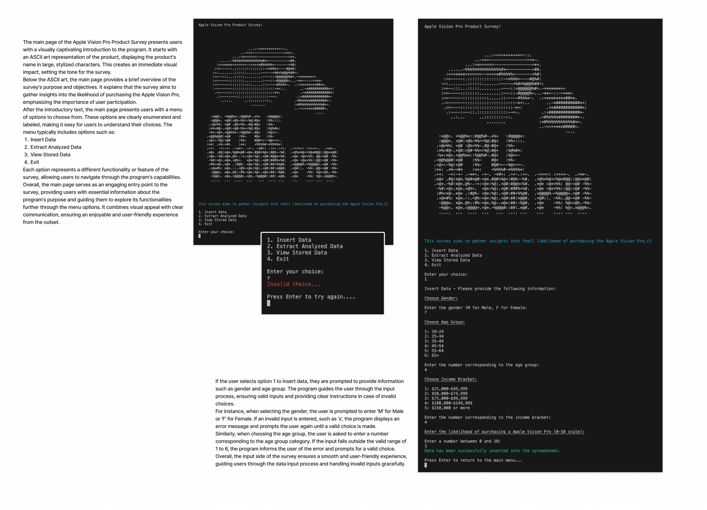
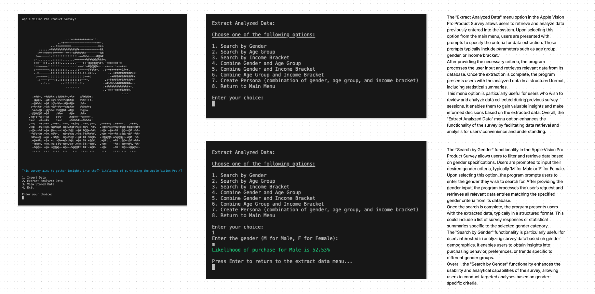
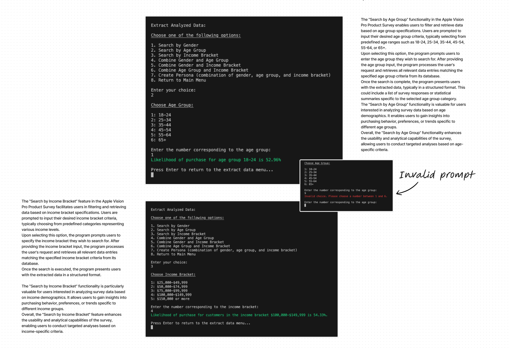
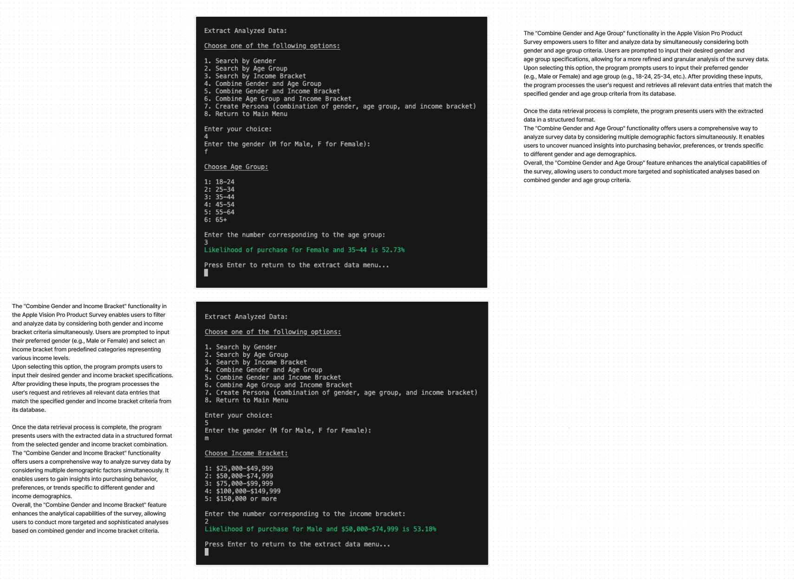
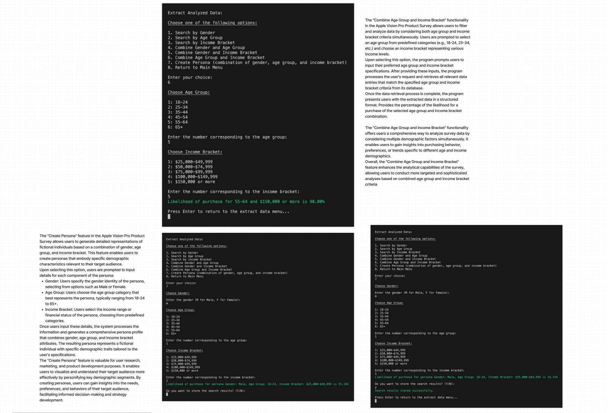
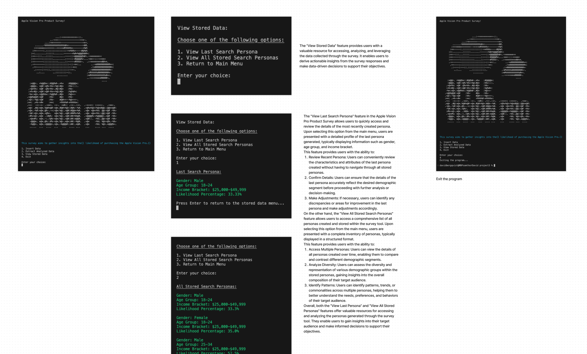

# Apple Vision Pro Product Survey

The Apple Vision Pro Product Survey is a Python application designed to gather insights into the likelihood of purchasing the Apple Vision Pro product. It allows users to input demographic data such as gender, age group, income bracket, and likelihood of purchase on a 0-10 scale. The application then analyzes this data and provides various options to extract and view analyzed results based on different criteria.

- [Deployed page](https://apple-vision-pro-survey-46239bd7970b.herokuapp.com/)
- [Data spreadsheet](https://docs.google.com/spreadsheets/d/1smBjfvvnpdDnmvxKwiwAl2V6hCMFwyGIR9vtk1-deY0/edit?usp=sharing)

## Table of Contents
  - [UX - Five Planes](#ux---five-planes)
  - [Future Features](#future-features)
  - [Technology Used](#technology-used)
  - [Testing](#testing)
  - [Development](#development)
  - [Deployment](#deployment)
  - [Credits](#credits)

## UX - Five Planes

### Strategy:

The app implements a survey system for gathering insights into the likelihood of purchasing a product, specifically the Apple Vision Pro. The app utilizes Google Sheets for data storage and analysis. 

- **Clarity in Purpose:** We've made sure that users understand exactly what our survey is about. The introduction is brief but informative, so everyone knows what to expect.
- **Intuitive Interaction:** We've kept things simple. Clear instructions, descriptive prompts, and straightforward options make the whole process a breeze.
- **Error Handling and Validation:** Nobody likes running into errors. That's why we've put in place robust mechanisms to handle mistakes and guide users with helpful messages.
- **Feedback and Confirmation:** It's always nice to know when you've done something right. We provide immediate feedback and use visual cues to confirm successful actions.
- **Navigation:** Getting around should be easy. We've designed the system to be intuitive.
- **Consistency and Visual Design:** We believe in keeping things consistent. From colors to layout, everything is designed with usability in mind.

#### User Goals:

- **Providing Input Data::** Users aim to input their demographic information, such as gender, age group, income bracket, and likelihood of purchasing the Apple Vision Pro product. The goal is to contribute their data for analysis.
- **Extracting Analyzed Data:** Users want to extract analyzed data based on various criteria such as gender, age group, income bracket, or combinations thereof. The goal is to obtain insights into the likelihood of purchase for different demographic segments.
- **Viewing Stored Data:** Users may want to view previously stored data, including the details of the last search persona or all stored search personas. The goal is to review past searches and their results for reference or further analysis.
- **Creating Personas:** Users may be interested in creating personas by specifying gender, age group, and income bracket to calculate the likelihood of purchase for those personas. The goal is to understand the purchasing behavior of specific demographic profiles.
- **Storing Search Results:** Users may want to store the results of their searches for future reference or analysis. The goal is to retain important insights gained from analyzing demographic data.
- **Navigating the Application:** Users aim to navigate the application smoothly, accessing different features and menus effortlessly. The goal is to have a user-friendly experience while interacting with the survey application.
- **Exiting the Program:** Users may need to exit the program after completing their tasks or when they no longer need to use the application. The goal is to gracefully terminate the application session.

#### Owner Goals:

- **Collecting Data:** The owner aims to collect valuable demographic data from users regarding their likelihood of purchasing the Apple Vision Pro product. The goal is to gather insights into potential customer segments.
- **Analyzing Data:** The owner intends to analyze the collected data to identify patterns, trends, and preferences among different demographic groups. The goal is to understand the target market better and refine marketing strategies accordingly.
- **Generating Insights:** The owner seeks to generate actionable insights from the analyzed data to inform product development, marketing campaigns, and overall business strategy. The goal is to make data-driven decisions that maximize the product's success in the market.
- **Improving Product Offering:** Based on the insights gained from the survey data, the owner aims to make improvements to the Apple Vision Pro product to better align with customer preferences and needs. The goal is to enhance the product's appeal and competitiveness in the market.
- **Enhancing User Experience:** The owner strives to enhance the user experience of the survey application, ensuring it is intuitive, easy to use, and engaging for participants. The goal is to encourage more users to provide data and maximize participation rates.
- **Driving Product Adoption:** Ultimately, the owner aims to drive product adoption and increase sales of the Apple Vision Pro product by leveraging insights from the survey data to target marketing efforts effectively and address customer needs. The goal is to achieve commercial success and maximize revenue potential.

### Scope:

- **Survey Design and Development:** Designing the survey questionnaire to gather relevant information about users' likelihood of purchasing the Apple Vision Pro product. Developing the survey application with user-friendly interfaces for seamless participation.
- **Data Collection and Storage:** Collecting demographic data and user responses through the survey application. Storing survey data securely in a cloud storage system, adhering to data protection regulations.
- **Data Analysis and Insights Generation:** Analyzing survey data to identify trends, patterns, and insights regarding potential customer segments. Generating actionable insights to inform marketing strategies, product development decisions, and business planning.
- **Reporting and Visualization:** Data can be used to create reports and visualizations to present survey findings in a clear and understandable format. Incorporating charts, graphs, and dashboards to facilitate data interpretation and decision-making.
- **User Experience (UX) Design:** Ensuring a smooth and intuitive user experience throughout the survey application.
Designing interfaces that are responsive, accessible, and visually appealing to encourage user engagement.
- **Security and Compliance:** Implementing robust security measures to protect user data from unauthorized access, data breaches, or cyber threats.
Ensuring compliance with relevant data protection regulations, such as GDPR or CCPA, to safeguard user privacy.
- **Scalability and Performance:** Designing the survey application to handle a large number of users and survey responses efficiently.
Optimizing performance to minimize latency and ensure responsiveness during peak usage periods.
- **Integration and Compatibility:** Integrating the survey application with other systems or platforms, such as customer relationship management (CRM) software or analytics tools.
Ensuring compatibility with various devices and web browsers to reach a broad audience of users.
- **Maintenance and Support:** Providing ongoing maintenance and technical support to address any issues, bugs, or user inquiries related to the survey application.
Updating the application regularly to add new features, improve functionality, and address emerging needs or requirements.

### Structure:

- **Main Application Interface:** Terminal Interface: The primary interface for users to interact with the survey. It should provide clear instructions, display survey questions, and receive user input through text-based prompts.
Menu System: A menu-driven system to navigate through different survey sections, view instructions, and submit responses.
Text Formatting: Utilize text formatting techniques (e.g., colors, styles) to enhance readability and provide visual cues.
- **Backend System:** Survey Logic: Modules to manage survey flow, including branching logic based on user responses and validation of input.
Data Management: Functions to store survey responses temporarily in memory or persistently in files or databases.
Error Handling: Mechanisms to handle errors gracefully, provide helpful error messages, and guide users through troubleshooting steps.
- **Security Measures: Implement security best practices to protect sensitive data and prevent unauthorized access.** Packaging: Tools to package the application for easy distribution and installation on different operating systems.
Dependency Management: Utilize dependency management tools (e.g., pip for Python) to manage external libraries and ensure consistent behavior across environments.
Version Control: Use version control systems like Git to track changes.
- **Documentation and Support:** User Manual: Detailed instructions on how to use the terminal-based survey application, including navigating menus, entering responses, and troubleshooting common issues.
Developer Documentation: Technical documentation for developers contributing to the project, covering code structure, module dependencies, and contribution guidelines.
Community Support: Establish channels for users and developers to seek help, provide feedback, and engage with the project community (e.g., online forums, issue trackers).

### Skeleton:

- **Import Statements:** Import necessary modules such as gspread and google.oauth2.service_account.
Define a class Color for text color formatting.
- **Constants:** Define SCOPE for the Google Sheets API access scope.
Load credentials from a JSON file (creds.json in this case).
- **Authentication and Setup:** Authenticate using the credentials and set up the Google Sheets client.
- **Welcome Message Function:** Define a function welcome_message() to display the welcome message and menu options.
- **Input Data Functionality:** Implement insert_data() function to prompt the user to input survey data and append it to the Google Sheet
- **Extract Analyzed Data Functionality:** Implement functions for extracting analyzed data based on various criteria:
extract_analyzed_data(), search_by_gender(), search_by_age_group(), search_by_income_bracket(), etc.
Each function handles different search criteria and combinations.
- **View Stored Data Functionality:** Implement view_stored_data() function to provide options for viewing stored search data.
- **Helper Functions:** Implement helper functions such as press_enter_to_main_menu(), press_enter_to_extract_data_menu(), and clear_screen() to improve user experience and maintain code clarity.
- **Main Function:** Implement the main() function to control the flow of the program, which repeatedly displays the main menu and processes user input until the user chooses to exit.
- **onditional Execution:** The if __name__ == "__main__": block ensures that the main() function is executed when the script is run directly.

### Surface:

- **User Interface:** The program runs in a terminal or command prompt environment.
Upon execution, the user is greeted with a welcome message, some ascii art and a menu of options.

The menu typically includes options such as:
- Input survey data
- Extract analyzed data
- View stored data
- Exit program
The interface should be intuitive and provide clear instructions for the user to navigate through the options.
- **Input Survey Data:** Users can input survey data, which typically includes information such as gender, age, income, and responses to survey questions.
The program prompts the user to enter the required information one by one, validating input where necessary.
Once the data is entered, i*t is appended to the Google Sheets document for storage and analysis.
- **Extract Analyzed Data:** Users can extract analyzed data based on different criteria, such as gender, age group, or income bracket.
The program provides options for the user to select the desired criteria and retrieves the corresponding data from the Google Sheets document.
Analyzed data may include statistics, summaries, or filtered subsets of the original survey data.
- **View Stored Data:** Users can view stored survey data, which may include both raw input data and analyzed data.
The program presents the data in a readable format, possibly using tabular or structured layouts.
Users may have the option to scroll through the data or view specific sections based on their preferences.
- **Exit Program:** Users have the option to exit the program at any time.
Choosing this option terminates the program and returns the user to the command prompt or terminal environment.

## Future Features

We are thrilled to introduce a series of enhancements designed to elevate the user experience:

- **Front-end Landing Page Creation:** Enhance user experience with a captivating front-end landing page.
- **Expanded Product Updates:** Extend our reach by including updates for other products, providing a comprehensive platform for information dissemination.
- **Diverse Demographic Input Options:** Offer a broader range of demographic options to provide a more inclusive and tailored experience.
- **Enhanced Research Capabilities:** Enrich your research endeavors with an expanded array of questions, empowering deeper exploration and analysis.
- **Visualized Analysis:** Generate insightful report cards featuring visualized analysis, including charts for enhanced comprehension and decision-making.
- **Seamless Integration:** Facilitate effortless communication by enabling users to seamlessly send search results via email, promoting efficient collaboration and sharing.

## Technology Used

- Back-end: Python
- Figma for wireframes
- ChatGPT - for AI assistance
- https://pep8ci.herokuapp.com/: Utilized to perform test of Python code.
- https://www.asciiart.eu/image-to-ascii: Generating ASCII art image

## Testing
 
Testing is an indispensable aspect of software development, ensuring that code functions as intended and meets quality standards. Among the various types of testing, linting, responsiveness testing, and manual testing play crucial roles in guaranteeing the reliability and usability of software products.

- **Linter Test:** Linting is a static code analysis technique that identifies syntax errors, coding style violations, and potential bugs in source code. Utilizing tools like pylint or flake8, developers can automatically detect issues and enforce coding standards. The Linter Test image showcases the results of running a Python linter, providing developers with insights into code cleanliness and adherence to best practices.
- **Responsiveness Overview:** In today's multi-device landscape, ensuring a seamless user experience across different screen sizes and devices is paramount. Responsiveness testing evaluates how a web application or site adapts to various viewport dimensions, including desktops, tablets, and smartphones. The Responsiveness Overview image offers a visual representation of how the interface behaves across different screen sizes, highlighting areas that may require optimization for improved usability and accessibility.
- **Method for Manual Test:** While automated testing tools offer efficiency and scalability, manual testing remains essential for validating user interactions, visual elements, and edge cases that may not be easily captured through automation. The Method for Manual Test image likely illustrates a structured approach or checklist for conducting manual tests, guiding testers through scenarios to verify functionality, usability, and user interface elements.

- [Linter test](docs/ci-python-linter-test.png)
- [Responsiveness overview](docs/responsive-test.png)
- [Method for manual test](docs/manual-test.png)

## Development

The development of the app involves creating a product survey tool for gathering insights into the likelihood of purchasing the Apple Vision Pro.

- **Welcome Message and Menu:** Upon starting the program, users are greeted with a welcome message introducing the purpose of the survey. They are then presented with a menu that allows them to choose various options: insert data, extract analyzed data, view stored data, or exit the program.
- **Insert Data:** Users can input information such as gender, age group, income bracket, and likelihood of purchasing the Apple Vision Pro on a scale of 0-10. The input data is validated and then appended to a Google Sheets document named "ProductSurvey."
- **Extract Analyzed Data:** Users can extract analyzed data based on different criteria such as gender, age group, income bracket, or combinations thereof. They can also create a persona by specifying gender, age group, and income bracket to calculate the likelihood of purchase for that persona.
- **View Stored Data:** Users have the option to view stored search data, including the last search persona or all stored search personas.
- **Clear Screen Functionality:** The program includes a function to clear the terminal, providing a cleaner user interface.
- **Input Validation:** Throughout the program, input validation ensures that users enter correct and valid data, enhancing the overall user experience.

The app is developed using Python and leverages the gspread library for interacting with Google Sheets. It also utilizes Google OAuth for authentication and authorization purposes. Additionally, the app includes ASCII art representation of the Apple logo for aesthetic appeal.

Overall, the app provides a user-friendly interface for conducting product surveys and extracting valuable insights into customer preferences and behavior regarding the Apple Vision Pro.

## Deployment

Deploying applications using Heroku and GitHub integration offers developers a streamlined and efficient process, enabling seamless deployment of code changes to production environments. Heroku, a cloud platform as a service (PaaS), simplifies deployment and management tasks, while GitHub serves as a collaborative platform for version control and code hosting.
[Deployed page](https://apple-vision-pro-survey-46239bd7970b.herokuapp.com/)

- **Integration Process:** The integration between Heroku and GitHub automates the deployment process, facilitating continuous integration and continuous deployment (CI/CD) workflows. Developers link their GitHub repositories to Heroku applications, allowing for automatic deployment whenever changes are pushed to specific branches, such as the main branch (formerly known as master) or designated release branches.
- **Automatic Deployment Workflow:** Once the integration is configured, the deployment workflow typically follows these steps:
- **Code Changes:** Developers make changes to the codebase locally and push commits to GitHub.
GitHub Actions/Heroku Pipeline: GitHub Actions, or another CI/CD tool, detects the new commits and triggers the deployment process. Heroku pipelines, if configured, manage the flow of changes through different stages (e.g., development, staging, production).
- **Build and Test:** Heroku retrieves the latest code from the linked GitHub repository [Repository](https://github.com/davidb3rgqvist/project3) and initiates the build process. This step involves compiling source code, installing dependencies, and running automated tests to ensure code quality and functionality.
- **Deployment:** Upon successful build and testing, Heroku deploys the application to the designated environment (e.g., staging or production). The deployment process involves deploying containers (if using Heroku's container service), updating dynos, and configuring any necessary environment variables.
- **Post-Deployment Checks:** Once deployed, Heroku may perform additional health checks or execute post-deployment scripts to verify the application's readiness and stability.
- **Rollback (if necessary):** In the event of deployment failures or issues, Heroku provides mechanisms for rolling back to previous versions, mitigating downtime and minimizing the impact on users.
Benefits:

- **Automation:** The integration between Heroku and GitHub automates the deployment process, reducing manual intervention and enabling rapid iteration and delivery of features.
- **Visibility and Collaboration:** By leveraging GitHub's collaboration features and version control capabilities, teams gain visibility into code changes, collaborate effectively, and track the progress of deployments.
- **Scalability and Reliability:** Heroku's platform handles infrastructure management, scalability, and security, allowing developers to focus on building and deploying applications without worrying about server maintenance or provisioning.
In summary, deploying applications using Heroku and GitHub integration offers a seamless, automated workflow that enhances collaboration, accelerates delivery, and improves the overall reliability of software deployments.

### Accessing the Deployed Site

The deployed application can be accessed using the following URL: https://apple-vision-pro-survey-46239bd7970b.herokuapp.com/
The spreadsheet with stored data can be accessed using the following URL: https://docs.google.com/spreadsheets/d/1smBjfvvnpdDnmvxKwiwAl2V6hCMFwyGIR9vtk1-deY0/edit?usp=sharing

## Credits

This application was developed as part of [Project3 - Apple Vision Pro Product Survey].

### Third party Libraries

- **The gspread library:** The third-party Python library that allows interaction with Google Sheets programmatically

### External Resources

- **GitHub:** Facilitated version control and hosting of the project with GitHub Pages.

### Inspirations and Mentors

- **Brian O'Hare / Code Institute:** Provided guidance, mentorship, or inspiration during the project's development.
- **Code Institute:** Primary educational content encompassing comprehensive videos elucidating Python. Mainly from the "Love Sandwiches Walktrough Project". [Repository with code base](https://github.com/Code-Institute-Solutions/love-sandwiches-p5-sourcecode/tree/master/01-getting-set-up/02-connecting-oto-our-api-with-python)

We extend our heartfelt gratitude to all who have contributed, both directly and indirectly, to the Apple Vision Pro Product Survey project. Your invaluable input has played a significant role in shaping and refining this application, catering to the needs of users and researchers alike seeking comprehensive insights in market analysis for this product.