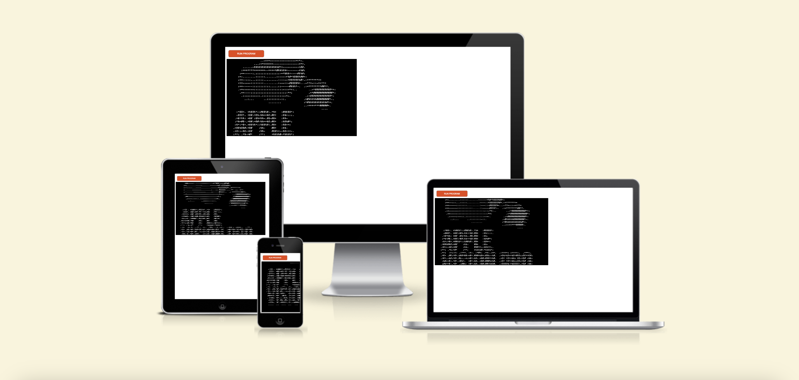
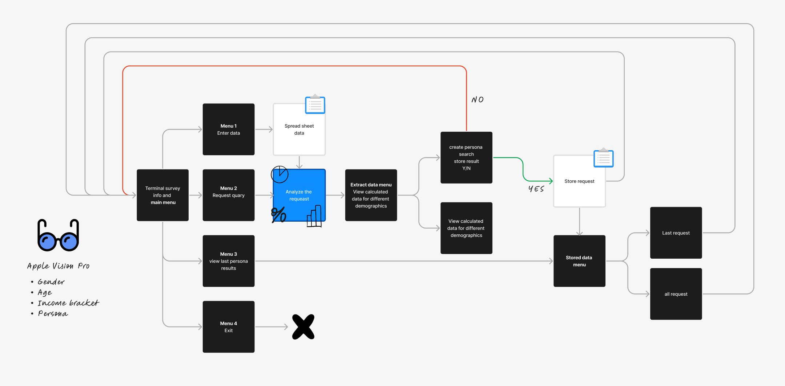
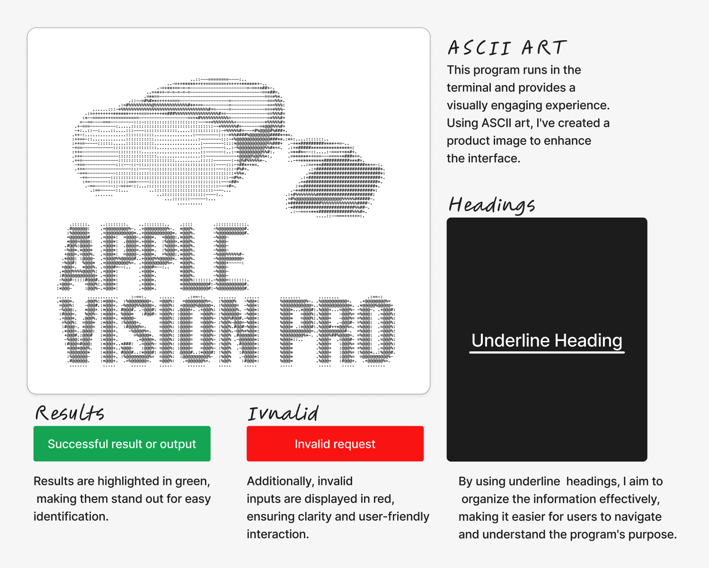

# Apple Vision Pro Product Survey

The Apple Vision Pro Product Survey is a Python application designed to gather insights into the likelihood of purchasing the Apple Vision Pro product. It allows users to input demographic data such as gender, age group, income bracket, and likelihood of purchase on a 0-10 scale. The application then analyzes this data and provides various options to extract and view analyzed results based on different criteria.

- [Deployed page](https://apple-vision-pro-survey-46239bd7970b.herokuapp.com/)
- [Data spreadsheet](https://docs.google.com/spreadsheets/d/1smBjfvvnpdDnmvxKwiwAl2V6hCMFwyGIR9vtk1-deY0/edit?usp=sharing)

## Table of Contents
  - [UX - Five Planes](#ux---five-planes)
  - [Future Features](#future-features)
  - [Technology Used](#technology-used)
  - [Testing](#testing)
  - [Development](#development)
  - [Deployment](#deployment)
  - [Credits](#credits)

## UX - Five Planes

### Strategy:

The app implements a survey system for gathering insights into the likelihood of purchasing a product, specifically the Apple Vision Pro. The app utilizes Google Sheets for data storage and analysis. 

- **Clarity in Purpose:** We've made sure that users understand exactly what our survey is about. The introduction is brief but informative, so everyone knows what to expect.

- **Intuitive Interaction:** We've kept things simple. Clear instructions, descriptive prompts, and straightforward options make the whole process a breeze.

- **Error Handling and Validation:** Nobody likes running into errors. That's why we've put in place robust mechanisms to handle mistakes and guide users with helpful messages.

- **Feedback and Confirmation:** It's always nice to know when you've done something right. We provide immediate feedback and use visual cues to confirm successful actions.

- **Navigation:** Getting around should be easy. We've designed the system to be intuitive.

- **Consistency and Visual Design:** We believe in keeping things consistent. From colors to layout, everything is designed with usability in mind.

#### User Goals:

- **Providing Input Data::** Users aim to input their demographic information, such as gender, age group, income bracket, and likelihood of purchasing the Apple Vision Pro product. The goal is to contribute their data for analysis.
- **Extracting Analyzed Data:** Users want to extract analyzed data based on various criteria such as gender, age group, income bracket, or combinations thereof. The goal is to obtain insights into the likelihood of purchase for different demographic segments.
- **Viewing Stored Data:** Users may want to view previously stored data, including the details of the last search persona or all stored search personas. The goal is to review past searches and their results for reference or further analysis.
- **Creating Personas:** Users may be interested in creating personas by specifying gender, age group, and income bracket to calculate the likelihood of purchase for those personas. The goal is to understand the purchasing behavior of specific demographic profiles.
- **Storing Search Results:** Users may want to store the results of their searches for future reference or analysis. The goal is to retain important insights gained from analyzing demographic data.
- **Navigating the Application:** Users aim to navigate the application smoothly, accessing different features and menus effortlessly. The goal is to have a user-friendly experience while interacting with the survey application.
- **Exiting the Program:** Users may need to exit the program after completing their tasks or when they no longer need to use the application. The goal is to gracefully terminate the application session.

#### Owner Goals:

- **Collecting Data:** The owner aims to collect valuable demographic data from users regarding their likelihood of purchasing the Apple Vision Pro product. The goal is to gather insights into potential customer segments.
- **Analyzing Data:** The owner intends to analyze the collected data to identify patterns, trends, and preferences among different demographic groups. The goal is to understand the target market better and refine marketing strategies accordingly.
- **Generating Insights:** The owner seeks to generate actionable insights from the analyzed data to inform product development, marketing campaigns, and overall business strategy. The goal is to make data-driven decisions that maximize the product's success in the market.
- **Improving Product Offering:** Based on the insights gained from the survey data, the owner aims to make improvements to the Apple Vision Pro product to better align with customer preferences and needs. The goal is to enhance the product's appeal and competitiveness in the market.
- **Enhancing User Experience:** The owner strives to enhance the user experience of the survey application, ensuring it is intuitive, easy to use, and engaging for participants. The goal is to encourage more users to provide data and maximize participation rates.
- **Driving Product Adoption:** Ultimately, the owner aims to drive product adoption and increase sales of the Apple Vision Pro product by leveraging insights from the survey data to target marketing efforts effectively and address customer needs. The goal is to achieve commercial success and maximize revenue potential.

### Scope:

- **Survey Design and Development:** Designing the survey questionnaire to gather relevant information about users' likelihood of purchasing the Apple Vision Pro product. Developing the survey application with user-friendly interfaces for seamless participation.

- **Data Collection and Storage:** Collecting demographic data and user responses through the survey application. Storing survey data securely in a cloud storage system, adhering to data protection regulations.

- **Data Analysis and Insights Generation:** Analyzing survey data to identify trends, patterns, and insights regarding potential customer segments. Generating actionable insights to inform marketing strategies, product development decisions, and business planning.

- **Reporting and Visualization:** Data can be used to create reports and visualizations to present survey findings in a clear and understandable format. Incorporating charts, graphs, and dashboards to facilitate data interpretation and decision-making.

- **User Experience (UX) Design:**

Ensuring a smooth and intuitive user experience throughout the survey application.
Designing interfaces that are responsive, accessible, and visually appealing to encourage user engagement.

- **Security and Compliance:**

Implementing robust security measures to protect user data from unauthorized access, data breaches, or cyber threats.
Ensuring compliance with relevant data protection regulations, such as GDPR or CCPA, to safeguard user privacy.

- **Scalability and Performance:**

Designing the survey application to handle a large number of users and survey responses efficiently.
Optimizing performance to minimize latency and ensure responsiveness during peak usage periods.

- **Integration and Compatibility:**

Integrating the survey application with other systems or platforms, such as customer relationship management (CRM) software or analytics tools.
Ensuring compatibility with various devices and web browsers to reach a broad audience of users.

- **Maintenance and Support:**

Providing ongoing maintenance and technical support to address any issues, bugs, or user inquiries related to the survey application.
Updating the application regularly to add new features, improve functionality, and address emerging needs or requirements.

### Structure:

- **Main Application Interface:**

Terminal Interface: The primary interface for users to interact with the survey. It should provide clear instructions, display survey questions, and receive user input through text-based prompts.
Menu System: A menu-driven system to navigate through different survey sections, view instructions, and submit responses.
Text Formatting: Utilize text formatting techniques (e.g., colors, styles) to enhance readability and provide visual cues.

- **Backend System:**

Survey Logic: Modules to manage survey flow, including branching logic based on user responses and validation of input.
Data Management: Functions to store survey responses temporarily in memory or persistently in files or databases.
Error Handling: Mechanisms to handle errors gracefully, provide helpful error messages, and guide users through troubleshooting steps.

- **Security Measures: Implement security best practices to protect sensitive data and prevent unauthorized access.**

Packaging: Tools to package the application for easy distribution and installation on different operating systems.
Dependency Management: Utilize dependency management tools (e.g., pip for Python) to manage external libraries and ensure consistent behavior across environments.
Version Control: Use version control systems like Git to track changes.

- **Documentation and Support:**

User Manual: Detailed instructions on how to use the terminal-based survey application, including navigating menus, entering responses, and troubleshooting common issues.
Developer Documentation: Technical documentation for developers contributing to the project, covering code structure, module dependencies, and contribution guidelines.
Community Support: Establish channels for users and developers to seek help, provide feedback, and engage with the project community (e.g., online forums, issue trackers).

### Skeleton:

- **Import Statements:**

Import necessary modules such as gspread and google.oauth2.service_account.
Define a class Color for text color formatting.

- **Constants:**

Define SCOPE for the Google Sheets API access scope.
Load credentials from a JSON file (creds.json in this case).

- **Authentication and Setup:**

Authenticate using the credentials and set up the Google Sheets client.

- **Welcome Message Function:**

Define a function welcome_message() to display the welcome message and menu options.

- **Input Data Functionality:**

Implement insert_data() function to prompt the user to input survey data and append it to the Google Sheet.

- **Extract Analyzed Data Functionality:**

Implement functions for extracting analyzed data based on various criteria:
extract_analyzed_data(), search_by_gender(), search_by_age_group(), search_by_income_bracket(), etc.
Each function handles different search criteria and combinations.

- **View Stored Data Functionality:**

Implement view_stored_data() function to provide options for viewing stored search data.

- **Helper Functions:**

Implement helper functions such as press_enter_to_main_menu(), press_enter_to_extract_data_menu(), and clear_screen() to improve user experience and maintain code clarity.

- **Main Function:**

Implement the main() function to control the flow of the program, which repeatedly displays the main menu and processes user input until the user chooses to exit.

- **onditional Execution:**

The if __name__ == "__main__": block ensures that the main() function is executed when the script is run directly.

### Surface:

- **User Interface:**

The program runs in a terminal or command prompt environment.
Upon execution, the user is greeted with a welcome message, some ascii art and a menu of options.

The menu typically includes options such as:
- Input survey data
- Extract analyzed data
- View stored data
- Exit program
The interface should be intuitive and provide clear instructions for the user to navigate through the options.

- **Input Survey Data:**

Users can input survey data, which typically includes information such as gender, age, income, and responses to survey questions.
The program prompts the user to enter the required information one by one, validating input where necessary.
Once the data is entered, it is appended to the Google Sheets document for storage and analysis.

- **Extract Analyzed Data:**

Users can extract analyzed data based on different criteria, such as gender, age group, or income bracket.
The program provides options for the user to select the desired criteria and retrieves the corresponding data from the Google Sheets document.
Analyzed data may include statistics, summaries, or filtered subsets of the original survey data.

- **View Stored Data:**

Users can view stored survey data, which may include both raw input data and analyzed data.
The program presents the data in a readable format, possibly using tabular or structured layouts.
Users may have the option to scroll through the data or view specific sections based on their preferences.

- **Exit Program:**

Users have the option to exit the program at any time.
Choosing this option terminates the program and returns the user to the command prompt or terminal environment.

## Future Features

In our pipeline are the following exciting features set to elevate your experience:

- Create a front-end landing page, for better UX
- Expansion to include updates for other products.
- More demographic options to input
- Enriched research capabilities with a wider array of questions.
- Generate report cards with visualized analysis, including charts for better comprehension.
- Seamless integration allowing users to effortlessly send search results via email.

## Technology Used

- Back-end: Python
- Figma for wireframes
- ChatGPT - for AI assistance
- https://pep8ci.herokuapp.com/: Utilized to perform test of Python code.
- https://www.asciiart.eu/image-to-ascii: Generating ASCII art image

## Testing

XXXXXX

- [HTML Validation of index.html, no errors found](docs/index-validation.png)
- [CSS Validation of style.css, no errors found](docs/css-validation.png)
- [JavaScript Validation, no errors found](docs/javascript-validation.png)
- [Linter test](docs/ci-python-linter-test.png)
- [Responsiveness overview](docs/responsive-test.png)

## Development

In crafting WordStream Learning, our development journey revolved around harnessing the power of HTML5, CSS3, and JavaScript. These technologies served as the backbone, providing a solid foundation for the website's structure, style, and interactive features. Our approach embraced a mobile-first philosophy, ensuring a seamless experience across various devices. To bring our vision to life, we leveraged Figma for meticulous UI/UX design and relied on Git and GitHub for effective version control.

As we chart the course for future development, we've identified key areas that can further enrich the WordStream Learning experience:

- **User-Centric Enhancements:** Place a premium on user feedback to enhance the overall user experience. Consider implementing user registration, profile management, and avenues for user-generated content, fostering a more personalized connection.

- **Feature Expansion:** Enrich the platform by introducing advanced search filters, seamless integration with social media platforms, and engaging features such as forums or challenges. These additions will contribute to a vibrant and interactive community.

- **Improving Accessibility:** Strive for inclusivity by ensuring adherence to accessibility standards, catering to users with diverse needs and disabilities.

- **Continual Testing and Optimization:** Uphold a commitment to excellence through an ongoing testing strategy. Identify and address bugs, enhance performance, and validate design changes to ensure a polished user experience.

- **Community Engagement:** Cultivate a sense of community by encouraging user-driven content creation. Welcome feedback with open arms and respond promptly to user queries or concerns, fostering a responsive and vibrant community.

- **Security Measures:** Fortify the platform with robust security measures. Safeguard user data, mitigate potential vulnerabilities, and proactively prevent security breaches to uphold user trust.

By embracing these strategic steps, our vision for WordStream Learning is not just a website but a dynamic hub for language learning. This roadmap emphasizes user-centric design, feature richness, accessibility, continuous improvement, community engagement, and robust security. As we embark on this journey, we remain committed to delivering a learning experience that goes beyond expectations.

## Deployment

[Deployed page](https://apple-vision-pro-survey-46239bd7970b.herokuapp.com/)
The deployment process involved leveraging GitHub Pages, an integrated service provided by GitHub, to publish the website directly from the project's repository. Here are the steps for deployment:

1. **GitHub Repository:** The Apple Vision Pro Product Survey's codebase resides in a GitHub repository. - [Repository](https://github.com/davidb3rgqvist/project3)
   
2. **Branch Setup:** Utilizing the default 'main' branch to host the deployable code.

3. **Configuration:** Configuring the repository settings within the GitHub repository's settings page to select the branch to deploy.

4. **GitHub Pages:** Enabling GitHub Pages from the repository settings to initiate the deployment process.

5. **Verification:** Verifying the deployment status and ensuring the website is live and accessible at the specified GitHub Pages URL.
https://docs.google.com/spreadsheets/d/1smBjfvvnpdDnmvxKwiwAl2V6hCMFwyGIR9vtk1-deY0/edit?usp=sharing: See stored data

### Accessing the Deployed Site

The deployed application can be accessed using the following URL: [https://apple-vision-pro-survey-46239bd7970b.herokuapp.com/](hhttps://apple-vision-pro-survey-46239bd7970b.herokuapp.com/)

The Heruko deployment offers a convenient way to share the Apple Vision Pro Product Survey app with users globally.

## Credits

XXX

### Open-Source Libraries

- **Code Institute:** Primary educational content encompassing comprehensive videos elucidating Python. Mainly from the "Love Sandwiches Walktrough Project". https://github.com/Code-Institute-Solutions/love-sandwiches-p5-sourcecode/tree/master/01-getting-set-up/02-connecting-oto-our-api-with-python

### External Resources

- **GitHub:** Facilitated version control and hosting of the project with GitHub Pages.

### Inspirations and Mentors

- **Brian O'Hare / Code Institute:** Provided guidance, mentorship, or inspiration during the project's development.

We extend our heartfelt gratitude to all who have contributed, both directly and indirectly, to the Apple Vision Pro Product Survey project. Your invaluable input has played a significant role in shaping and refining this application, catering to the needs of users and researchers alike seeking comprehensive insights in market analysis for this product.